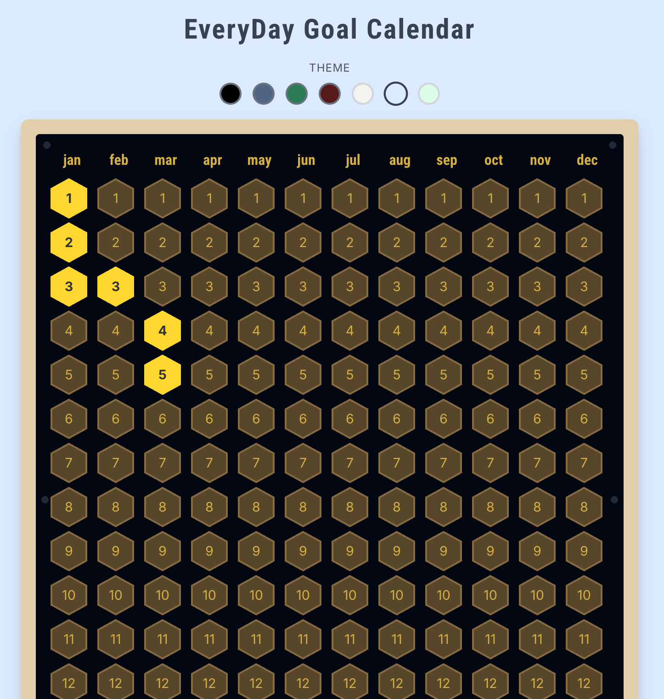

# Vibe Coded Everyday Goal Calendar Flask App

## Overview
A beautiful hexagonal goal calendar built with Flask and Firebase that allows users to track their daily achievements with cloud sync and multiple themes.

## Demo



## Features
- 🔐 **Firebase Authentication** - Secure Google Sign-in
- ☁️ **Cloud Sync** - Progress saved to Firestore database
- 🎨 **Multiple Themes** - 7 elegant color themes
- 📱 **Responsive Design** - Works on desktop, tablet, and mobile
- 📅 **Hexagonal Calendar** - Unique and beautiful calendar layout
- 🎯 **Custom Favicon** - Hexagonal favicon matching the calendar design

## Setup Instructions

### 1. Prerequisites
- Python 3.7+
- Firebase project (see FIREBASE_SETUP.md)

### 2. Installation
```bash
# Clone or download the project
cd Calendar\ Goal

# Create virtual environment
python -m venv venv
source venv/bin/activate  # On Windows: venv\Scripts\activate

# Install dependencies
pip install -r requirements.txt
```

### 3. Firebase Configuration
Follow the detailed instructions in `FIREBASE_SETUP.md` to:
1. Create a Firebase project
2. Enable Authentication and Firestore
3. Get configuration files
4. Set up security rules

### 4. Environment Setup
```bash
# Copy environment template
cp .env.example .env

# Edit .env file with your configuration
# Set a strong SECRET_KEY for production
```

### 5. Firebase Files Setup

**Spark free plan console.firebase.google.com **
1. Download your Firebase service account key as `firebase-config.json`
2. Update `static/firebase-auth.js` with your Firebase web config
3. Place both files in the project root

### 6. Run the Application
```bash
# Development
python app.py

# Production (with Gunicorn)
gunicorn -w 4 -b 0.0.0.0:5000 app:app
```

## Project Structure
```
Calendar Goal/
├── app.py                      # Main Flask application
├── requirements.txt            # Python dependencies
├── .env.example               # Environment variables template
├── firebase-config.json.example # Firebase service account template
├── FIREBASE_SETUP.md          # Firebase setup instructions
├── templates/
│   ├── login.html            # Login page
│   └── calendar.html         # Main calendar page
└── static/
    ├── firebase-auth.js      # Firebase authentication
    └── calendar.js           # Calendar functionality
```


## Deployment

- Ensure all environment variables are set
- Upload `firebase-config.json` securely
- Use `gunicorn` for production server

## Security Notes
- Never commit `firebase-config.json` to version control
- Use strong `SECRET_KEY` in production
- Enable Firebase security rules in production
- Use HTTPS in production

## Firestore Data Structure
```javascript
// users/{userId}
{
  "email": "user@example.com",
  "progress": {
    "0-1": true,    // Month 0 (Jan), Day 1 completed
    "0-15": true,   // Month 0 (Jan), Day 15 completed
    "1-5": true     // Month 1 (Feb), Day 5 completed
  },
  "theme": "#111827",
  "last_updated": "2023-12-01T12:00:00Z"
}
```


## License
This project is open source. Feel free to modify and use as needed.
